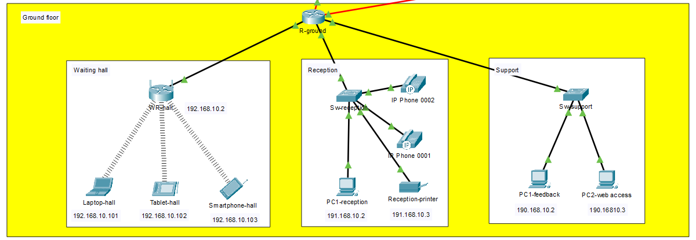

# Hotel Local Area Network (LAN) Implementation - Cisco Packet Tracer

## Overview

This project demonstrates the implementation of a Local Area Network (LAN) for a multi-floor hotel using Cisco Packet Tracer (CPT). The hotel's network infrastructure comprises three floors: ground floor, first floor, and second floor, each containing rooms with specific purposes. The network elements, including PCs, IP phones, and printers, are interconnected through switches, and all switches are further linked with a common router that provides connectivity on each floor. Proper IP addressing has been configured for each sector of the network, ensuring seamless communication and optimal functionality. The entire network setup is virtually simulated using Cisco Packet Tracer (CPT), leveraging the technology of Cisco Certified Network Associate (CCNA).

# Network Topology

The hotel's Local Area Network (LAN) is organized into three floors, with each floor housing various rooms that serve specific functions. The network elements, such as PCs, IP phones, wireless devices, and printers, are interconnected using switches to facilitate seamless communication and data exchange. Below is a detailed overview of the network topology for each floor:

## Ground Floor

The Ground Floor consists of three rooms, each with its unique purpose:

1. **Waiting Hall:**
   - This room provides customer seating with WiFi access, secured with a password.
   - Components: 1 Wireless LAN (WRT300N), 1 Smart device, 1 Wireless Tablet, and 1 Laptop.

2. **Reception Room:**
   - The reception room is responsible for handling room bookings and sending billing information to the owner/admin PC.
   - The printer is utilized for printing bills.
   - Components: 1 Switch (2950-24), 1 Printer, 1 PC, and 2 IP Phones (7960).

3. **Feedback and Support Room:**
   - In this room, two PCs are used for providing feedback to the owner and accessing the hotel's website.
   - Components: 1 Switch (2950-24) and 2 PCs.

## First Floor

 <!-- Replace with an image depicting the first floor topology -->

The First Floor comprises seven rooms:

1. **Food Service Room:**
   - This room handles food orders and has a PC to store or send billing information to the owner.
   - Food orders are received through IP phones.
   - Components: 1 Switch (2950-24), 1 PC, 1 Printer, and 1 IP Phone (7960).

2. **Rooms:**
   - These customer rooms are equipped with wireless LAN (WRT300N), IP phones (7960), smart devices, and wireless tablets.
   - Three rooms share a common WiFi network, and two common IP phones serve these rooms.
   - Components: 2 Wireless LAN (WRT300N), 4 IP Phones (7960), 4 Smart Devices, and 2 Wireless Tablets.

## Second Floor

 <!-- Replace with an image depicting the second floor topology -->

The Second Floor consists of two rooms:

1. **Server Room:**
   - The server room houses servers responsible for managing the entire hotel network.
   - Components: 1 Switch (2950-24), DNS server, web server, Email server, and FTP server.

2. **Admin Room:**
   - In the admin room, an Admin PC is used to check billing information, customer feedback, and send or receive files.
   - Components: 1 Switch (2950-24), 1 IP Phone (7960), 1 Printer, and 1 PC.

## Internet Connectivity

The second-floor router connects to the Internet through a cluster that comprises 1 router, 1 switch, and 1 server. All floor routers are routed to this cluster, providing Internet access to the entire hotel network.

