# Hotel Local Area Network (LAN) Implementation - Cisco Packet Tracer

## Overview

This project demonstrates the implementation of a Local Area Network (LAN) for a multi-floor hotel using Cisco Packet Tracer (CPT). The hotel's network infrastructure comprises three floors: the ground floor, first floor, and second floor, each containing rooms with specific purposes. The network elements, including PCs, IP phones, and printers, are interconnected through switches, and all switches are further linked with a common router that provides connectivity on each floor. Proper IP addressing has been configured for each sector of the network, ensuring seamless communication and optimal functionality. The entire network setup is virtually simulated using Cisco Packet Tracer (CPT), leveraging the technology of Cisco Certified Network Associate (CCNA).

# Network Topology

The hotel's Local Area Network (LAN) is organized into three floors, with each floor housing various rooms that serve specific functions. The network elements, such as PCs, IP phones, wireless devices, and printers, are interconnected using switches to facilitate seamless communication and data exchange. Below is a detailed overview of the network topology for each floor:

## Ground Floor

The Ground Floor consists of three rooms, each with its unique purpose:

1. **Waiting Hall:**
   - This room provides customer seating with WiFi access, secured with a password.
   - Components: 1 Wireless LAN (WRT300N), 1 Smart device, 1 Wireless Tablet, and 1 Laptop.

2. **Reception Room:**
   - The reception room is responsible for handling room bookings and sending billing information to the owner/admin PC.
   - The printer is utilized for printing bills.
   - Components: 1 Switch (2950-24), 1 Printer, 1 PC, and 2 IP Phones (7960).

3. **Feedback and Support Room:**
   - In this room, two PCs are used for providing feedback to the owner and accessing the hotel's website.
   - Components: 1 Switch (2950-24) and 2 PCs.

## First Floor

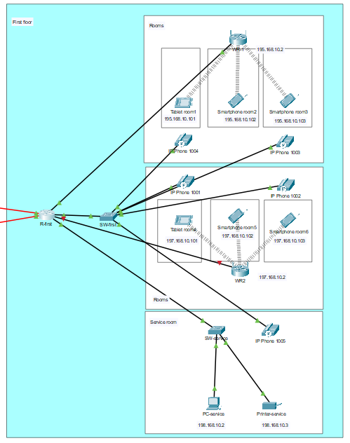

The First Floor comprises seven rooms:

1. **Food Service Room:**
   - This room handles food orders and has a PC to store or send billing information to the owner.
   - Food orders are received through IP phones.
   - Components: 1 Switch (2950-24), 1 PC, 1 Printer, and 1 IP Phone (7960).

2. **Rooms:**
   - These customer rooms are equipped with wireless LAN (WRT300N), IP phones (7960), smart devices, and wireless tablets.
   - Three rooms share a common WiFi network, and two common IP phones serve these rooms.
   - Components: 2 Wireless LAN (WRT300N), 4 IP Phones (7960), 4 Smart Devices, and 2 Wireless Tablets.

## Second Floor

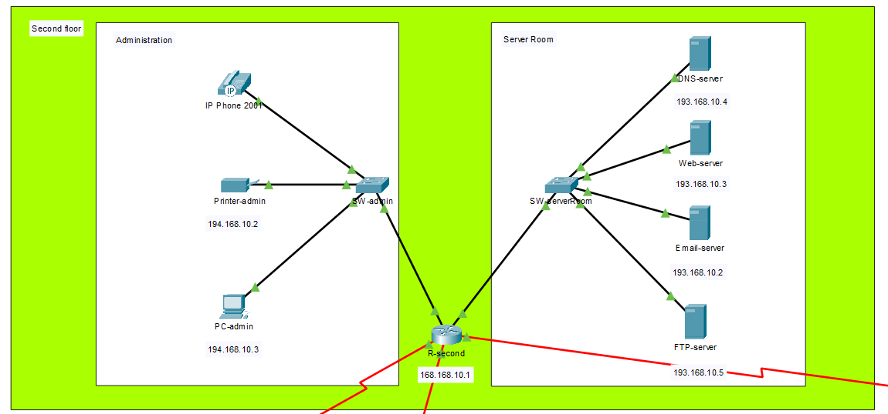

The Second Floor consists of two rooms:

1. **Server Room:**
   - The server room houses servers responsible for managing the entire hotel network.
   - Components: 1 Switch (2950-24), DNS server, web server, Email server, and FTP server.

2. **Admin Room:**
   - In the admin room, an Admin PC is used to check billing information, customer feedback, and send or receive files.
   - Components: 1 Switch (2950-24), 1 IP Phone (7960), 1 Printer, and 1 PC.

## Internet Connectivity

The second-floor router connects to the Internet through a cluster that comprises 1 router, 1 switch, and 1 server. All floor routers are routed to this cluster, providing Internet access to the entire hotel network.

## IP Address Configuration

IP addresses are unique identifiers used to identify devices on the Internet or a Local Area Network (LAN). In this project, I am utilizing Class B IP addresses. A Class B IP address consists of the first ten bits fixed as '10', followed by a network address of 14 bits and a host address of 16 bits. The range of Class B IP addresses is from 128.0.0.0 to 191.255.255.255.

The table below shows the IP addresses assigned to the network entities:

| Component        | IP Address     |
|------------------|----------------|
| Router 1         | 193.168.10.4   |
| Common Router 1  | 195.168.10.1   |
| Common Router 2  | 197.168.10.1   |

## Configuration of Switches and Wireless LANs

The following figures depict the configuration of the Wireless LAN (Waiting Hall WLAN). It employs WPA2-PSK authentication with the passphrase. The DNS server IP address is set to 193.168.10.4. The configuration for common router 1 follows the same process, and its DNS server IP address is also 193.168.10.4. WPA2-PSK encryption is used, and the default gateway is set to 195.168.10.1. For common router 2, the default gateway is configured as 197.168.10.1, and WPA2-PSK is used for encryption. Each switch is configured with a password and requires a username-password combination to access and modify the IOS command line interface, enhancing overall security.

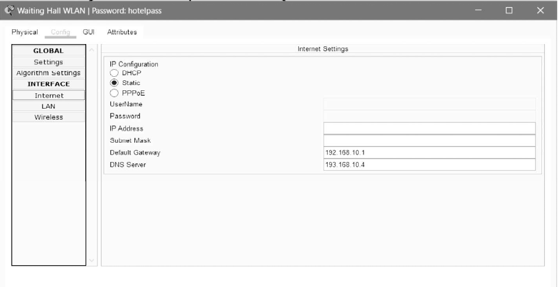

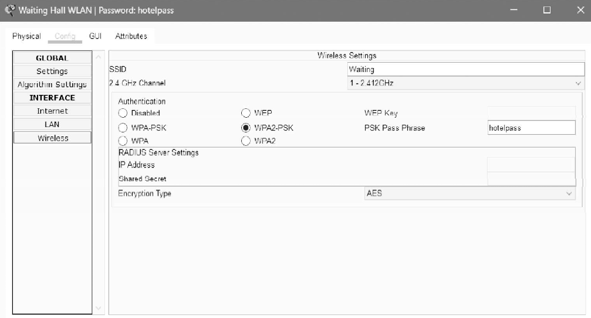

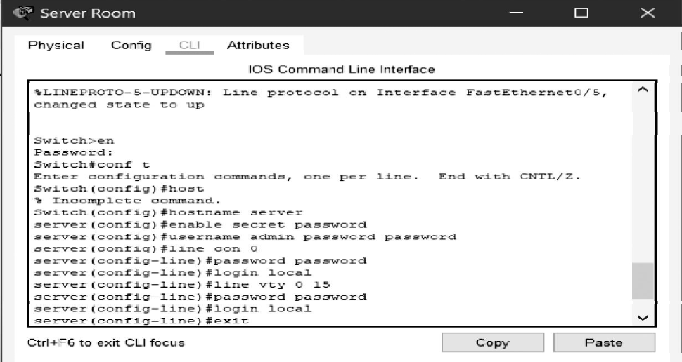

## IP Address Configuration

The table below displays the IP addresses and default gateways for various components in the network:

| Component              | IP Address     | Default Gateway |
|------------------------|----------------|-----------------|
| Guest 1 (Smart Device) | 192.168.10.103 | 192.168.10.1   |
| Guest 2 (Wireless Tablet) | 192.168.10.102 | 192.168.10.1   |
| Guest 3 (Laptop) | 192.168.10.101 | 192.168.10.1   |
| Waiting Hall WLAN | 192.168.10.1   | 192.168.10.1   |
| Reception (Switch 2950-24) | 191.168.10.1   | 191.168.10.1   |
| Reception Printer | 191.168.10.3   | 191.168.10.1   |
| Reception PC | 191.168.10.2   | 191.168.10.1   |
| Feedback and Support Room | 190.168.10.1   | 190.168.10.1   |
| Feedback PC | 190.168.10.2   | 190.168.10.1   |
| Website Access PC | 190.168.10.2   | 190.168.10.1   |
| Food Service (Switch 2950-24) | 198.168.10.1   | 198.168.10.1   |
| Food Service PC | 198.168.10.2   | 198.168.10.1   |
| Food Service Printer | 198.168.10.3   | 198.168.10.1   |
| Common Router 2 (WLAN) | 197.168.10.1   | 197.168.10.1   |
| Common Router 1 (WLAN) | 195.168.10.1   | 195.168.10.1   |
| IP Switch (Switch 2950-24) | 196.168.10.1   | 196.168.10.1   |
| Guest 1 Tab (Wireless Tablet) | 195.168.10.101 | 195.168.10.1   |
| Guest 2 Mobile (Mobile) | 195.168.10.102 | 195.168.10.1   |
| Guest 3 Mobile (Mobile) | 195.168.10.103 | 195.168.10.1   |
| Guest 4 Tab (Wireless Tablet) | 197.168.10.101 | 197.168.10.1   |
| Guest 5 Mobile (Mobile) | 197.168.10.102 | 197.168.10.1   |
| Guest 6 Mobile (Mobile) | 197.168.10.103 | 197.168.10.1   |
| Server Room (Switch 2950-24) | 193.168.10.1   | 193.168.10.1   |
| DNS Server | 193.168.10.4   | 193.168.10.1   |
| Web Server | 193.168.10.3   | 193.168.10.1   |
| Email Server | 193.168.10.2   | 193.168.10.1   |
| FTP Server | 193.168.10.5   | 193.168.10.1   |
| Admin room (Switch 2950-24) | 194.168.10.1   | 194.168.10.1   |
| Admin PC | 194.168.10.3   | 194.168.10.1   |
| Admin Printer | 194.168.10.2   | 194.168.10.1   |
| Internet Switch (Switch 2950-24) | 166.168.10.1   | 166.168.10.1   |
| Internet Server | 166.168.10.2   | 166.168.10.2   |

## Configuration of IP phones

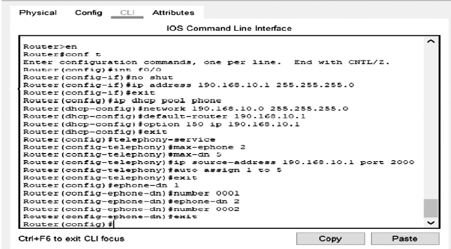

After configuring the switch, the IP phones are configured with the assigned dial numbers. All the IP phones are configured in a similar manner. Both the switch and router that the IP phone is connected to, should be configured.

## Results

Admin PC can ping all the PCs that are connected in the network. Pinging the reception PC and food service PC.

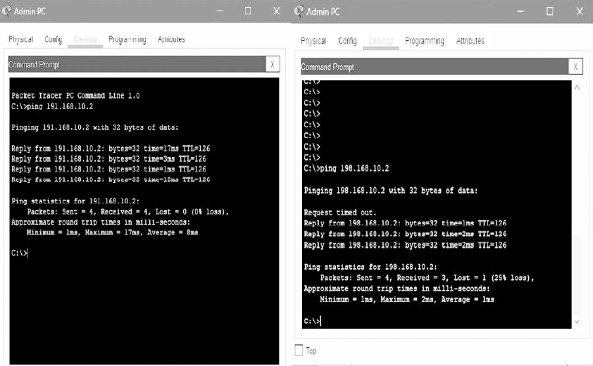

From the phone in the reception room, a call can be made to any IP phone in the hotel.

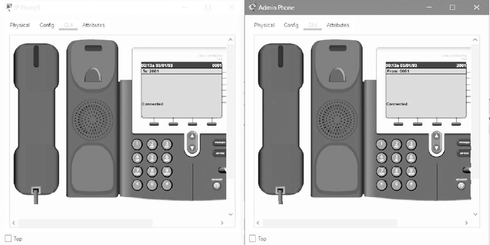

Website can be accessed from any smart device/laptop/tablet or from the website access PC.

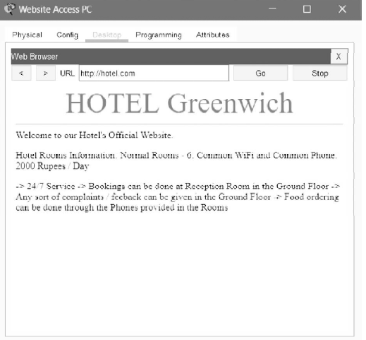

Feedback can be sent through the ‘Feedback PC’ to admin@hotel.in. The mail is sent from the user and received by the admin in admin PC.

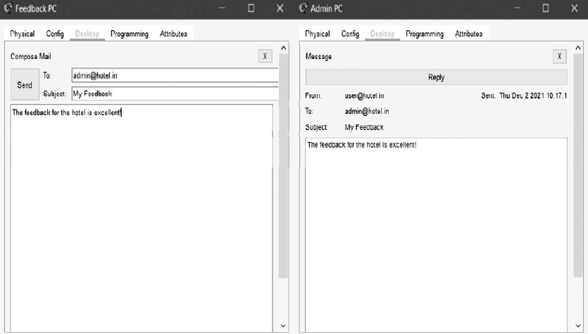

The billing information and the customer details can be sent to the owner (admin) from the reception PC via FTP service. The details file can be sent from the command prompt of the reception PC to the admin PC.

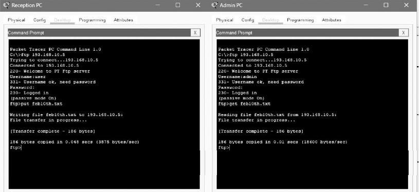

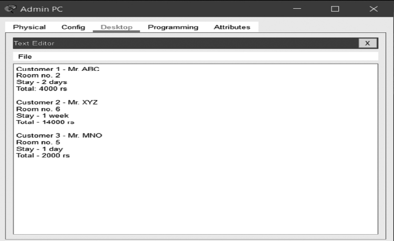
